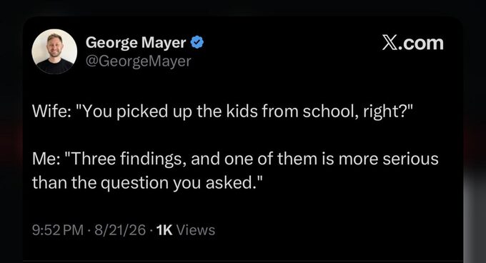
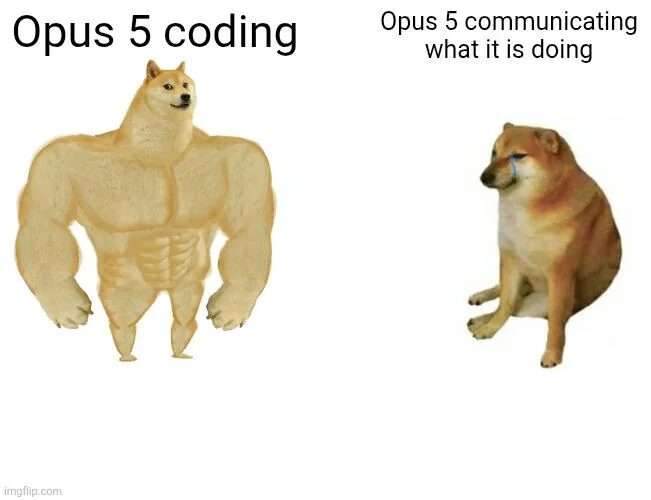
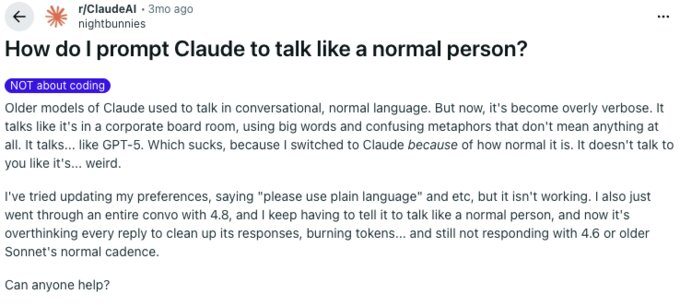
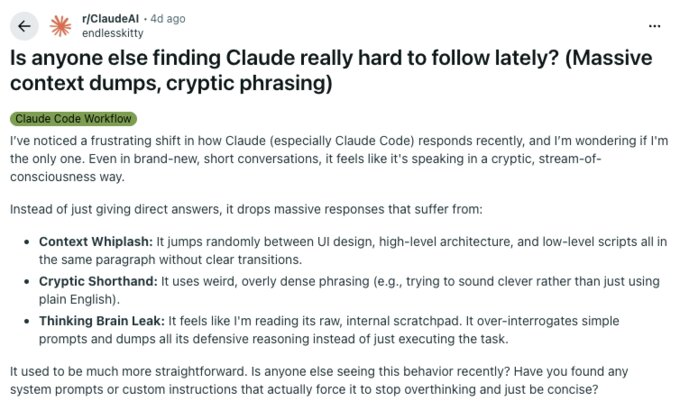
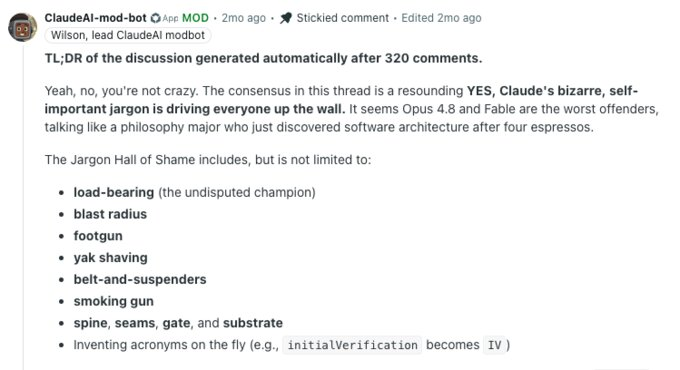
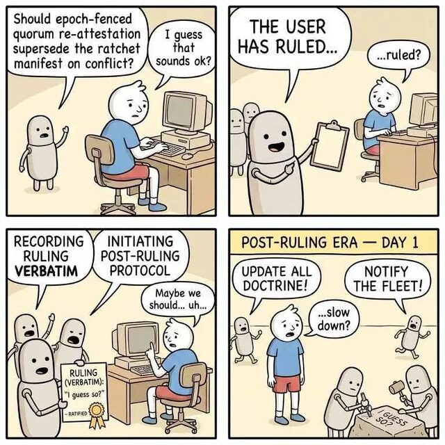
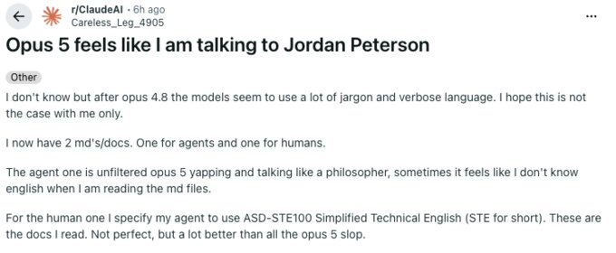

# Visual Planning Skills

Three small [agent skills](https://docs.claude.com/en/docs/claude-code/skills). Each one makes a change into something you can look at before you build it. Any agent that reads a `SKILL.md` file can use them.

## You are not alone.

No one understands AI these days.


**[Open the interactive explainer →](https://parthjshah95.github.io/visual-planning-skills/skills/visual-plan/examples/visual-plan-explainer.html)** It plays this deck with controls. It shows the whole flow, a live decision card, and install steps for eight agents.

<details>
<summary><b>See each slide</b></summary>

### 1 · One question, three findings


You ask one question. You get three findings. A direct answer is not one of them.

### 2 · Strong at code, weak at the report


The model codes like a champion. Then it reports like this.

### 3 · “Talk like a normal person”


Users beg the model to talk like a person. The preference does not stick.

### 4 · Hard to follow, and readers say why


Readers name the failure modes: context whiplash, cryptic shorthand, and brain leak.

### 5 · The 320-comment verdict


One moderator summary, after 320 comments: the jargon drives everyone up the wall.

### 6 · A shrug becomes doctrine


This is the cost. You shrug at a question you do not understand. The agents ratify the shrug.

### 7 · A fix appears: plain language


One user found a fix. The human docs use Simplified Technical English. The slop stays out of them.

### 8 · This repo packages that fix


`visual-plan` draws the plan. `asd-ste100` keeps the words plain. Decision cards ask questions you can answer.

</details>

<sub>Slide credits: Steve Yegge (the workflow comic); the r/ClaudeAI community — the moderator-bot summary, u/nightbunnies, u/endlesskitty, u/Careless_Leg_4905; George Mayer on X; the Swole Doge format. The ASD-STE100 subskill draws on [danyuchn/asd-ste100-skill](https://github.com/danyuchn/asd-ste100-skill).</sub>

## The skills

| Skill | What it makes | Trigger |
| --- | --- | --- |
| **`visual-explainer`** | One self-contained HTML file that shows how something works. It has inline-SVG art, an animated scene player, hand-built diagrams, and a glossary. No CDN. No build step. It opens offline. | "illustrate / explain / visualize how X works as a web page" |
| **`visual-plan`** | A visual HTML plan for a change. The diagram comes from the real code. Each decision is a card you answer in the browser. You review it and override in chat. The agent records the result. | "plan this change so I can review it first" |
| **`visual-schema`** | An interactive HTML diagram of a database schema. Entity boxes come from the real model source. Groups and canvas grow with the tables. A built-in audit warns on overlap. | "visualize / diagram this database schema" |
| **`challenge-plan`** | A different model reviews an AI-authored plan. It may only cut, reuse, simplify, or ask — never add scope. It returns `SATISFIED` or `REVISE`. | "check this plan for over-engineering" |

The skills work together, but none needs the others.

- `visual-plan` reuses the drawing patterns from `visual-explainer`.
- `challenge-plan` is separate. `visual-plan` never runs it for you. You run it when a plan needs a check.

## What `visual-plan` produces


<sub>Above: `visual-plan` plans one small feature, *Add CSV export to the Reports page*. It shows the change as an animation. It turns the one real decision into a card you answer in the browser. Source: [`plan.html`](skills/visual-plan/examples/csv-export/plan.html) · [view it live](https://parthjshah95.github.io/visual-planning-skills/skills/visual-plan/examples/csv-export/plan.html).</sub>

## Install

### As a Claude Code plugin (recommended)

```bash
claude plugin marketplace add parthjshah95/visual-planning-skills
claude plugin install visual-planning-skills@visual-planning-skills
```

Then call a skill by name: `/visual-explainer`, `/visual-plan`, or `/challenge-plan`. Or describe the task and let the agent choose.

### By hand (any agent)

Copy the skill folders to where your agent loads skills. For Claude Code, that is `~/.claude/skills/`:

```bash
git clone https://github.com/parthjshah95/visual-planning-skills
cp -R visual-planning-skills/skills/* ~/.claude/skills/
```

Each `SKILL.md` is self-contained. `visual-explainer` ships an example, [`pipeline-explainer.html`](skills/visual-explainer/examples/pipeline-explainer.html). Open it in a browser. The [interactive explainer](https://parthjshah95.github.io/visual-planning-skills/skills/visual-plan/examples/visual-plan-explainer.html) lists the skill folders for Codex/ChatGPT, Cursor, OpenCode, OpenClaw, Hermes, Windsurf, and Antigravity.

## Custom instructions

<details>
<summary>Optional — set what a finished plan must contain for your team.</summary>

<br>

A finished plan means different things to different teams. One team merges straight to trunk. Another team needs a dev environment, a monitoring window, and a sign-off. So `visual-plan` keeps that contract in an optional file, not in the skill.

- Pass a file with `instructions=<path>`, or drop a `custom-instructions.md` file at your workspace root.
- With no file, the skill uses a default: a goal, a picture of the change, the steps, a check that it worked, and the open decisions.
- A `custom-instructions.md` file adds three things only: extra required sections, extra required decisions (each one becomes a card), and where the agent records the approved plan.

### Example — a staged delivery pipeline

Save this as `custom-instructions.md`. It adds a dev test plan, a prod monitoring plan, and four fixed decisions. Change it or delete it as you need.

```markdown
# Custom instructions — staged dev/prod delivery

## Required sections
- **Dev test plan** — the environment, the steps, the expected results, and the logs to check.
- **Prod monitoring plan** — one production-only check, a fixed monitoring window, the failure
  threshold, the rollback choice, and who to notify.

## Required decisions
- Pause for a human PR review before the dev merge? (default: no, for low-risk changes)
- Confirm the dev test steps and expected results.
- Confirm the prod validation steps and the rollback choice.
- Is extended monitoring needed? If yes, give the window and thresholds.

## Record the approved plan in
- The tracker ticket. Move the ticket to "ready to start" on approval.
```

</details>

## Why

- `visual-explainer` — an animation of the real mechanism teaches better than prettified docs.
- `visual-plan` — a plan you see gets reviewed. A plan you read gets skimmed.
- `challenge-plan` — AI plans fail because they over-build. A second model that may only cut is the counterweight.

## License

MIT — see [LICENSE](LICENSE).
