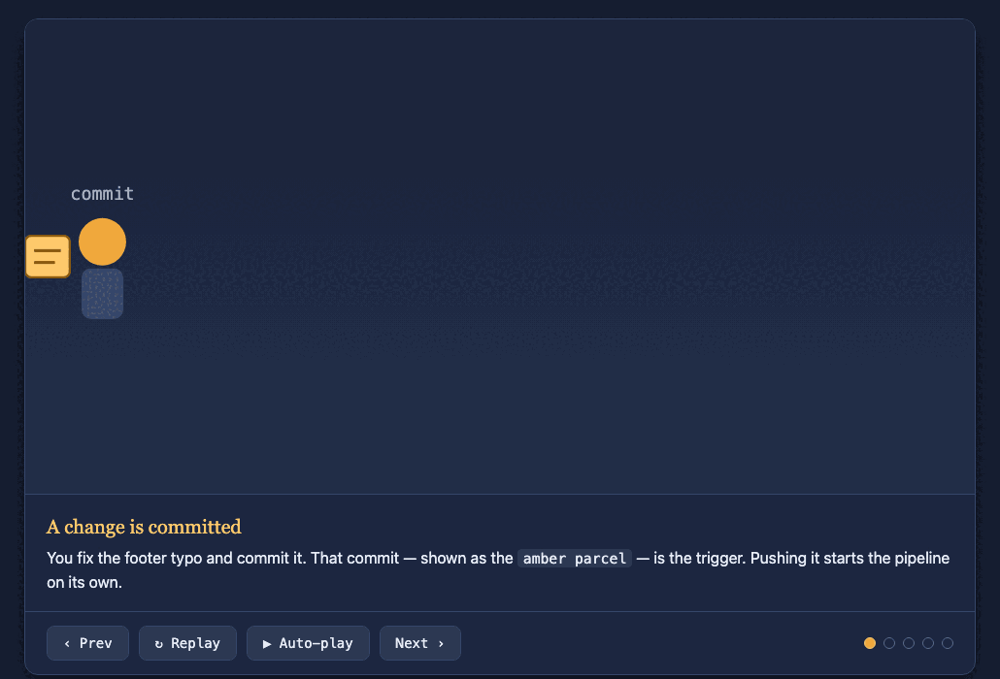
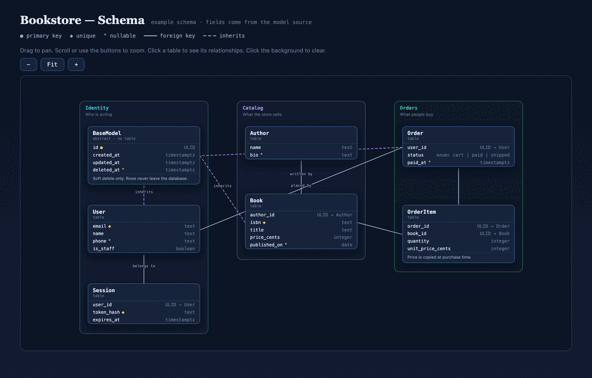

# Visual Planning Skills

Struggling to understand the giant walls of text your AI throws at you? Frustrated by jargon AI invents that only it can fathom?

## You are not alone.

No one understands AI these days.


**[Open the interactive explainer →](https://parthjshah95.github.io/visual-planning-skills/skills/visual-plan/examples/visual-plan-explainer.html)** It plays this deck with controls. It shows the whole flow, a live decision card, and install steps for eight agents.

<sub>Slide credits: Steve Yegge (the workflow comic); the r/ClaudeAI community: the moderator-bot summary, u/nightbunnies, u/endlesskitty, u/Careless_Leg_4905; the Swole Doge format. The ASD-STE100 subskill draws on [danyuchn/asd-ste100-skill](https://github.com/danyuchn/asd-ste100-skill).</sub>

## The fix



`visual-plan` draws the plan. `asd-ste100` keeps the words plain. Decision cards ask questions you can answer.

## The skills

| Skill | What it does |
| --- | --- |
| **`visual-explainer`** | "Visually explain how the code works." Creates an HTML file with animations and diagrams. |
| **`visual-plan`** | "Visually plan this task." Replaces the plan mode with an HTML version of it. Less text, more interactivity. |
| **`visual-schema`** | "Visualize my database schema." Visually see the models, relationships, and fields on a draggable canvas. |
| **`challenge-plan`** | "Challenge this plan for over-engineering." A different model reviews the plan. It may only cut, never add. |

The skills work together, but none needs the others.

- `visual-plan` reuses the drawing patterns from `visual-explainer`.
- `challenge-plan` is separate. `visual-plan` never runs it for you. You run it when a plan needs a check.

## What `visual-explainer` produces



<sub>Above: `visual-explainer` explains one subject, how a deploy pipeline works. A scene player walks the mechanism step by step. Source: [`pipeline-explainer.html`](skills/visual-explainer/examples/pipeline-explainer.html) · [view it live](https://parthjshah95.github.io/visual-planning-skills/skills/visual-explainer/examples/pipeline-explainer.html).</sub>

## What `visual-plan` produces


<sub>Above: `visual-plan` plans one small feature, *Add CSV export to the Reports page*. It shows the change as an animation. It turns the one real decision into a card you answer in the browser. Source: [`plan.html`](skills/visual-plan/examples/csv-export/plan.html) · [view it live](https://parthjshah95.github.io/visual-planning-skills/skills/visual-plan/examples/csv-export/plan.html).</sub>

## What `visual-schema` produces



<sub>Above: `visual-schema` draws a small bookstore database. The tables come from the model source. Click a table to see its relationships. Drag to pan, zoom to fit. Source: [`bookstore-schema.html`](skills/visual-schema/examples/bookstore-schema.html) · [view it live](https://parthjshah95.github.io/visual-planning-skills/skills/visual-schema/examples/bookstore-schema.html).</sub>

## Examples

Every example is one self-contained HTML file. Open the live link, or download the source and open it in a browser.

| Example | Made with | Open |
| --- | --- | --- |
| Deploy-pipeline explainer | `visual-explainer` | [live](https://parthjshah95.github.io/visual-planning-skills/skills/visual-explainer/examples/pipeline-explainer.html) · [source](skills/visual-explainer/examples/pipeline-explainer.html) |
| The visual-plan explainer (the deck above) | `visual-explainer` | [live](https://parthjshah95.github.io/visual-planning-skills/skills/visual-plan/examples/visual-plan-explainer.html) · [source](skills/visual-plan/examples/visual-plan-explainer.html) |
| CSV-export plan | `visual-plan` | [live](https://parthjshah95.github.io/visual-planning-skills/skills/visual-plan/examples/csv-export/plan.html) · [source](skills/visual-plan/examples/csv-export/plan.html) |
| Bookstore schema | `visual-schema` | [live](https://parthjshah95.github.io/visual-planning-skills/skills/visual-schema/examples/bookstore-schema.html) · [source](skills/visual-schema/examples/bookstore-schema.html) |

## Install

### As a Claude Code plugin (recommended)

```bash
claude plugin marketplace add parthjshah95/visual-planning-skills
claude plugin install visual-planning-skills@visual-planning-skills
```

Then call a skill by name: `/visual-explainer`, `/visual-plan`, `/visual-schema`, or `/challenge-plan`. Or describe the task and let the agent choose.

### By hand (any agent)

Copy the skill folders to where your agent loads skills. For Claude Code, that is `~/.claude/skills/`:

```bash
git clone https://github.com/parthjshah95/visual-planning-skills
cp -R visual-planning-skills/skills/* ~/.claude/skills/
```

Each `SKILL.md` is self-contained. The [interactive explainer](https://parthjshah95.github.io/visual-planning-skills/skills/visual-plan/examples/visual-plan-explainer.html) lists the skill folders for Codex/ChatGPT, Cursor, OpenCode, OpenClaw, Hermes, Windsurf, and Antigravity.

## Custom instructions

<details>
<summary>Optional: set what a finished plan must contain for your team.</summary>

<br>

A finished plan means different things to different teams. One team merges straight to trunk. Another team needs a dev environment, a monitoring window, and a sign-off. So `visual-plan` keeps that contract in an optional file, not in the skill.

- Pass a file with `instructions=<path>`, or drop a `custom-instructions.md` file at your workspace root.
- With no file, the skill uses a default: a goal, a picture of the change, the steps, a check that it worked, and the open decisions.
- A `custom-instructions.md` file adds three things only: extra required sections, extra required decisions (each one becomes a card), and where the agent records the approved plan.

### Example: a staged delivery pipeline

Save this as `custom-instructions.md`. It adds a dev test plan, a prod monitoring plan, and four fixed decisions. Change it or delete it as you need.

```markdown
# Custom instructions: staged dev/prod delivery

## Required sections
- **Dev test plan**: the environment, the steps, the expected results, and the logs to check.
- **Prod monitoring plan**: one production-only check, a fixed monitoring window, the failure
  threshold, the rollback choice, and who to notify.

## Required decisions
- Pause for a human PR review before the dev merge? (default: no, for low-risk changes)
- Confirm the dev test steps and expected results.
- Confirm the prod validation steps and the rollback choice.
- Is extended monitoring needed? If yes, give the window and thresholds.

## Record the approved plan in
- The tracker ticket. Move the ticket to "ready to start" on approval.
```

</details>

## License

MIT. See [LICENSE](LICENSE).
